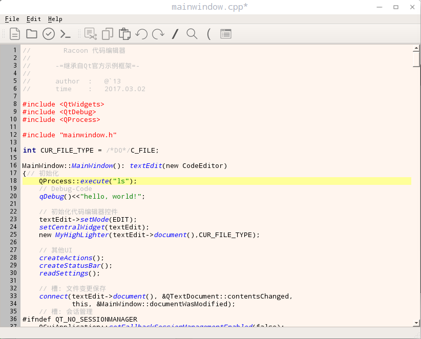

Racoon 
----------------------
Racoon is a simple text editor based on [Qt](https://www.qt.io/) 

### Introduce
Racoon is a simple text editor based on Qt , achieved the basic functions of commonly used code editor. refers to the official example of QT (*Application Example*) (*Code Editor Example*) .  the project is a homework for the school 
data structure curriculum design.

 * function 
	 * New File
	 * Open File
	 * Save
	 * Save As
	 * Run (**C**/**Java**/**Python**) *only on linux*	 
	 * Cut
	 * Copy
	 * Paste
	 * Undo
	 * Redo
	 * Comment
	 * Find
	 * Parenthes match
	 * Code Format
	 * Highlight

	
	 
### Installing
* Building
	* linux 
		* ```cd .../Racoon/Racoon/```
		* ```qmake –project```
		* ```qmake Racoon.pro```
		*  ```make```
		* ```./Racoon```
	* windows
		* open the project ```Racoon.pro``` by the **Qt Creator** 
		* **build** and **run**
	*  run function(extra)
		* install **GCC**
		* install **Python**
		* install **Java**
* Environment(developing)
	* **Qt Creator** 4.2.1 for Linux
	* Qt 5.8.0
	* GCC 6.2.0
	* OS : deepin 15.3 x64
　　　　　　　　　　　　
### License
* GNU GENERAL PUBLIC LICENSE 3.0

### About me
  * `13
  *  **z.g.13@163.com**/**h.j.13.new@gmail.com** 
  * Harbin Institute of Technology at Weihai
  * 2017年03月07日 
